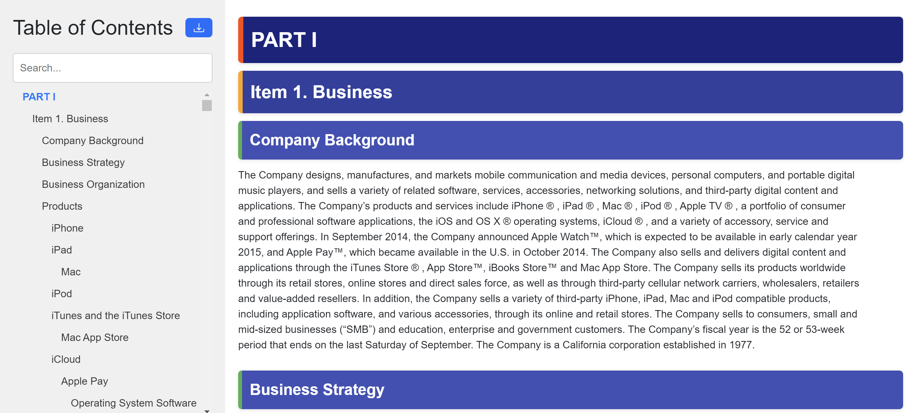

Parsing
=======

SEC XBRL Parsing 
---------------

Parse XBRL data in JSON format to tables:

.. code-block:: python

    from datamule import parse_company_concepts
    table_dict_list = parse_company_concepts(company_concepts)

Filing Parser
------------

Currently parses Forms 3, 13F-HR, NPORT-P, SC 13D, SC 13G, 10-Q, 10-K, 8-K, and D using a basic parser. 

For a more advanced parser see the Textual Filing Parsing below.
`Example <https://github.com/john-friedman/datamule-python/issues/4#issuecomment-2443299869>`_

TODO: 10-KSB etc

.. code-block:: python

    from datamule import Filing
    
    # Initialize Filing object
    filing = Filing(path, filing_type='8-K')
    filing = Filing(path,filing_type='13F-HR-INFORMATIONTABLE')
    
    # Parse the filing, using the declared filing type
    parsed_data = filing.parse_filing()

    # Or access the data as iterable e.g.
    import pandas as pd 
    df = pd.DataFrame(filing)

Example: accessing 10-K item 1c text:

.. code-block:: python

    parsed_filing['document']['part1']['item1c']

Example 8-K output:

.. code-block:: json

    {
        "metadata": {
            "document_name": "000000527223000041_aig-20231101"
        },
        "document": {
            "item202": "Item 2.02. Results of Operations and Financial Condition. On November 1, 2023, American International Group, Inc. (the \"Company\") issued a press release (the \"Press Release\") reporting its results for the quarter ended September 30, 2023. A copy of the Press Release is attached as Exhibit 99.1 to this Current Report on Form 8-K and is incorporated by reference herein. Section 8 - Other Events",
            "item801": "Item 8.01. Other Events. The Company also announced in the Press Release that its Board of Directors has declared a cash dividend of $0.36 per share on its Common Stock, and a cash dividend of $365.625 per share on its Series A 5.85% Non-Cumulative Perpetual Preferred Stock, which is represented by depositary shares, each of which represents a 1/1,000th interest in a share of preferred stock, holders of which will receive $0.365625 per depositary share. A copy of the Press Release is attached as Exhibit 99.1 to this Current Report on Form 8-K and is incorporated by reference herein. Section 9 - Financial Statements and Exhibits",
            "item901": "Item 9.01. Financial Statements and Exhibits. (d) Exhibits. 99.1 Press release of American International Group, Inc., dated November 1, 2023 . 104 Cover Page Interactive Data File (embedded within the Inline XBRL document). EXHIBIT INDEX Exhibit No. Description 99.1 Press release of American International Group, Inc., dated November 1, 2023 . 104 Cover Page Interactive Data File (embedded within the Inline XBRL document).",
            "signatures": "SIGNATURES Pursuant to the requirements of the Securities Exchange Act of 1934, the registrant has duly caused this report to be signed on its behalf by the undersigned hereunto duly authorized. AMERICAN INTERNATIONAL GROUP, INC. (Registrant) Date: November 1, 2023 By: /s/ Ariel R. David Name: Ariel R. David Title: Vice President and Deputy Corporate Secretary"
        }
    }

Textual Filing Parsing
---------------------

Parse textual filings into different formats using the datamule api. Note: datamule api is in beta, so if you want to use this at scale, please reach out to me: `John G Friedman <https://www.linkedin.com/in/johngfriedman/>`_. 

.. code-block:: python

    # Simplified HTML
    simplified_html = dm.parse_textual_filing(
        url='https://www.sec.gov/Archives/edgar/data/1318605/000095017022000796/tsla-20211231.htm', 
        return_type='simplify'
    )

    # Interactive HTML
    interactive_html = dm.parse_textual_filing(
        url='https://www.sec.gov/Archives/edgar/data/1318605/000095017022000796/tsla-20211231.htm', 
        return_type='interactive'
    )

    # JSON
    json_data = dm.parse_textual_filing(
        url='https://www.sec.gov/Archives/edgar/data/1318605/000095017022000796/tsla-20211231.htm', 
        return_type='json'
    )

.. image:: ../_static/simplify.png
   :alt: Simplified HTML Output Example
   :align: center

.. image:: ../_static/json.png
   :alt: JSON Output Example
   :align: center